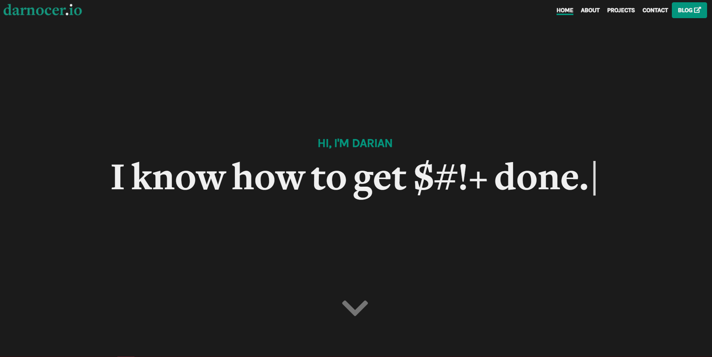

# Darian's Portfolio

  
    

## Live Demo: https://www.darnocer.io

## Credits

- **[Bootstrap](https://getbootstrap.com/docs/4.4/getting-started/introduction/)** - Basic Layout
- **[Font Awesome](https://fontawesome.com/)**
- **[99inbound](https://www.99inbound.com/)** - Handle contact form requests
- **[Vue.js](https://vuejs.org/v2/guide/)**
- **[SASS](https://sass-lang.com/)**
- **[AOS Library](https://github.com/michalsnik/aos)** - Animate on scroll library
- **[Typewriter Effect](https://www.npmjs.com/package/typewriter-effect)**
- **[Simple Icons](https://simpleicons.org/)** - Used for "tools" icons
- **[Hashnode](https://hashnode.com/)** - Easily link your blog to your personal domain
- **Adobe Illustrator** - Portfolio and blog cover photos
- **[Undraw](https://undraw.co/illustrations)** - Free Illustrations
- **[README Badges](https://github.com/alexandresanlim/Badges4-README.md-Profile)**
- **[Netlify](https://www.netlify.com/)** - My favorite hosting
- **[Jonas Schmedtmann](https://codingheroes.io/)** - Advanced Sass Concepts Course
- **[This codepen](https://codepen.io/joxmar/pen/NqqMEg)** - Highlighting active navbar items

## Contact

### Darian Nocera

**Email:** [hello@dariannocera.com](mailto:hello@dariannocera.com)

  

---

#### Copyright © 2020 [Darian Nocera](http://www.github.com/darnocer) 👽
